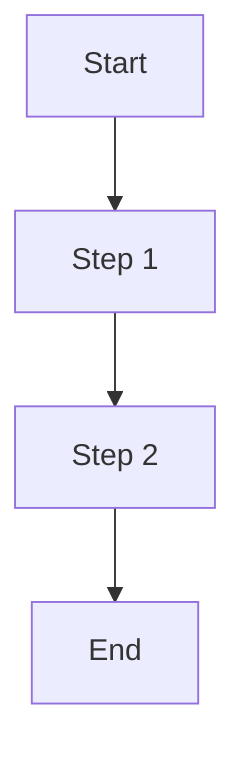

# GitHub Pages Integration

This template shows how to embed generated flow diagrams in GitHub Pages documentation.

## Basic Integration

Add this to your markdown files to display Mermaid diagrams:

```markdown
# Your Documentation Title

## Workflow Overview



## Advanced Integration with Jekyll

### _config.yml Configuration

```yaml
# Enable Mermaid support
markdown: kramdown
highlighter: rouge

plugins:
  - jekyll-mermaid

# Mermaid configuration
mermaid:
  src: 'https://cdn.jsdelivr.net/npm/mermaid/dist/mermaid.min.js'
```

## Best Practices

### 1. Responsive Design
```css
.mermaid svg {
    max-width: 100%;
    height: auto;
}
```

### 2. Link Validation
Test all diagram links before publishing.

### 3. SEO Optimization
Add diagram descriptions for accessibility.