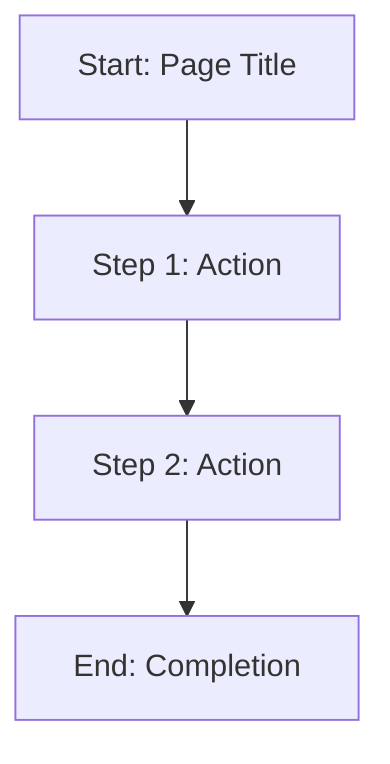

# Mermaid Templates and Best Practices

This reference provides templates and guidelines for generating consistent, interactive Mermaid flowcharts.

## Basic Flowchart Template



## Node Types and Shapes

### Process Nodes (Rectangles)
```mermaid
A[Standard Process Step]
```
**Use for**: Regular workflow steps, actions, processes

### Decision Nodes (Diamonds)
```mermaid
B{Decision Point?}
```
**Use for**: Conditional branches, yes/no questions, choices

### Start/End Nodes (Rounded)
```mermaid
C([Start Process])
D([End Process])
```
**Use for**: Clear workflow boundaries, entry/exit points

## Best Practices

### Node Naming
- **Be concise**: Max 3-4 words per node
- **Use action verbs**: "Configure", "Install", "Verify"
- **Be specific**: "Install CLI" vs "Install"
- **Consistent tense**: Use imperative form

### Flow Organization
- **Top to bottom**: Primary flow direction
- **Left to right**: For parallel processes
- **Minimize crossings**: Reduce line complexity

### Link Strategy
- **Every node should be clickable** when possible
- **Use descriptive link text**: Helpful for accessibility
- **Test all links**: Ensure they point to correct sections